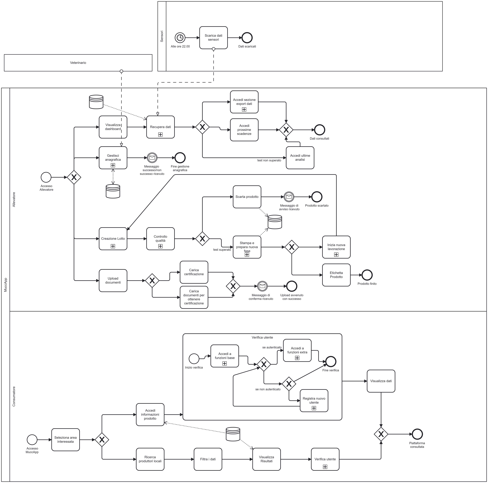

# **Deliverable D1** {#deliverable-d1}

**Deadline:** 27/03/2026

**Gruppo:** ID 13  
 **Componenti del gruppo:**

* Stefania, Milani,   
* Alice, Bortolotti,   
* Elena, Carmagnani, 

**Indice**

[**Deliverable D1	1**](#deliverable-d1)

[**1\. Obiettivi del Progetto	3**](#1.-obiettivi-del-progetto)

[1.1 Obiettivi Principali	3](#1.1-obiettivi-principali)

[1.2 Obiettivi Futuri	3](#1.2-obiettivi-futuri)

[**2\. Analisi SWOT	4**](#2.-analisi-swot:)

[Punti di forza (Strengths)	4](#punti-di-forza-\(strengths\):)

[Punti di debolezza (Weaknesses)	4](#punti-di-debolezza-\(weaknesses\):)

[Opportunità (Opportunities)	4](#opportunità-\(opportunities\):)

[Minacce (Threats)	4](#minacce-\(threats\):)

[**3\. Attori del sistema	5**](#3.-attori-del-sistema)

[3.2 Mappa degli Attori	5](#3.2-mappa-degli-attori)

[3.2 Utenti	5](#3.2-utenti)

[3.3 Sistemi esterni	6](#3.3-sistemi-esterni)

[**4\. Requisiti funzionali per attore	6**](#4.-requisiti-funzionali-per-attore)

[4.1 Consumatore (Utente non autenticato)	6](#4.1-consumatore-\(utente-non-autenticato\):)

[4.2 Consumatore (Utente autenticato)(estende 4.1)	6](#4.2-consumatore-\(utente-autenticato\)\(estende-4.1\):)

[4.3 Allevatore	6](#4.3-allevatore:)

[4.4 Distributore/Caseificio (opzionale)	7](#4.4-distributore/caseificio-\(opzionale\):)

[4.5 Veterinario (opzionale)	7](#4.5-veterinario-\(opzionale\):)

[4.6 Sistemi esterni	7](#4.6-sistemi-esterni:)

[**5\. Requisiti non funzionali	7**](#5.-requisiti-non-funzionali)

[**6\. Use case diagrams e casi d'uso	9**](#6.-use-case-diagrams-e-casi-d'uso)

[6.1 Use case diagram	9](#6.1-use-case-diagram)

[6.2 Use cases	10](#6.2-use-cases:)

[**7\. Diagramma BPMN	17**](#7.-diagramma-bpmn)

### 

## 

# **1\. Obiettivi del Progetto** {#1.-obiettivi-del-progetto}

## **1.1 Obiettivi Principali** {#1.1-obiettivi-principali}

**O1:** Monitorare il benessere delle vacche, raccogliendo dati vitali (come temperatura, frequenza cardiaca, attività e posizione) tramite sensori, e fornire alert in caso di anomalie o problemi di salute.

**O2:** Tracciare e mostrare la filiera dei prodotti caseari, dalla creazione del lotto di latte fino al prodotto finale, offrendo agli utenti (consumatori, allevatori, ecc.) una panoramica trasparente sulla provenienza, qualità e sostenibilità.

**O3:** Valorizzare i piccoli produttori locali, dando loro la possibilità di mostrare pratiche sostenibili e di differenziarsi dalla grande distribuzione grazie alla tracciabilità digitale e all’autenticità delle informazioni.

**O4:** Promuovere il consumo consapevole connettendo gli utenti a realtà produttive etiche e trasparenti. La piattaforma offre agli utenti non autenticati un accesso libero alla scoperta di piccole aziende locali, dettagliando prodotti e processi produttivi. Lo scopo è orientare l'acquisto verso produttori che garantiscono il benessere animale e la tutela della biodiversità.

**O5:** Fornire ai produttori un supporto al processo di certificazione, permettendo loro di dichiarare eventuali certificazioni possedute o organizzare i dati e documenti necessari per una futura richiesta. Offrire anche un sistema alternativo di verifica basato su tracciabilità dei processi e raccolta dei dati di monitoraggio, rendendo la qualità garantita e verificabile anche senza certificazione ufficiale.

**O6:** Fornire una dashboard intuitiva che permetta agli allevatori di gestire, monitorare e visualizzare i dati relativi agli animali, i prodotti, la filiera e le recensioni.

## **1.2 Obiettivi Futuri** {#1.2-obiettivi-futuri}

**O7:** Estendere il ruolo di Allevatore con un modulo che permette di gestire la vendita del prodotto grezzo a Distributori terzi, nel caso in cui l’Allevatore non si occupi della lavorazione e della vendita del prodotto finale.

**O8:** Estendere l’utilizzo del sistema di monitoraggio ad altre specie di animali da allevamento (es. pecore, capre, galline, ecc.) con rispettiva filiera, tramite moduli dedicati.

**O9:** Integrare funzioni predittive basate sull’analisi dei dati raccolti (es. predizioni sulle vendite dato l’andamento della produzione, consigli basati sui dati sanitari dell’animale, ecc.).

# **2\. Analisi SWOT:** {#2.-analisi-swot:}

### **Punti di forza (Strengths):** {#punti-di-forza-(strengths):}

* Soluzione innovativa che offre trasparenza sulla salute delle vacche e sulla qualità dei prodotti.  
* Supporto ai piccoli produttori locali e promozione di pratiche sostenibili.  
* Risponde alle esigenze di consumatori attenti al benessere animale e al rispetto dell’ambiente.  
* Facilità di accesso alle informazioni tramite sistema digitale intuitivo.  
* Possibilità per coloro che seguono un regime alimentare vegano, grazie alla trasparenza verso l’attenzione al benessere animale, di valutare la reintroduzione di alcuni alimenti nella propria dieta in modo consapevole.  
* Dashboard intuitiva per la gestione e il monitoraggio dei dati da parte di allevatori e consumatori.  
* Strumento che permette ai produttori di organizzare facilmente i dati e i documenti relativi al proprio allevamento, anche in vista di un’eventuale richiesta di certificazione ufficiale.

### **Punti di debolezza (Weaknesses):** {#punti-di-debolezza-(weaknesses):}

* Raccogliere dati affidabili sul benessere animale può essere difficile. Le condizioni che concorrono al benessere di un animale sono molteplici e in alcuni casi qualitative.  
* Molti produttori si trovano in zone remote (come pascoli di alta montagna) e potrebbero essere poco disponibili ad adottare tecnologie digitali, preferendo metodi tradizionali.  
* In molte aree rurali o di montagna la connessione Internet è assente o scarsa, rendendo difficile l’implementazione di soluzioni digitali.  
* La piattaforma potrebbe apparire troppo complessa o impegnativa per piccoli produttori privi di esperienza digitale.

### **Opportunità (Opportunities):** {#opportunità-(opportunities):}

* Crescita del mercato dei prodotti sostenibili, locali e a filiera trasparente.  
* Maggiore sensibilità dei consumatori verso il reale benessere animale.  
* Possibilità di espansione verso altri tipi di allevamenti e filiere alimentari.  
* Collaborazioni con associazioni ambientaliste e vegane.  
* Collaborazione con enti certificatori o veterinari volta ad aumentare il valore e la credibilità dei dati raccolti, nonché implementare nuove funzionalità e servizi.  
* Supportare il processo di certificazione grazie alla raccolta ordinata dei dati, incentivando nuovi e/o piccoli produttori a ottenere riconoscimenti ufficiali. 

### **Minacce (Threats):** {#minacce-(threats):}

* Resistenza da parte di produttori che non vogliono condividere/divulgare dati o adottare sistemi tecnologici.  
* Concorrenti che offrono soluzioni simili o piattaforme di tracciabilità.  
* Possibili cambiamenti nelle normative sul benessere animale.  
* Non tutti i consumatori sono sensibili alla tematica del benessere animale, quindi potrebbe non interessare alcuni consumatori/una parte del mercato.   
* I parametri necessari per la certificazione potrebbero essere limitati o non pienamente noti e il team potrebbe non avere una conoscenza sufficientemente approfondita delle procedure di certificazione ufficiale.  
* Presenza di piattaforme ministeriali di monitoraggio della salute veterinaria degli allevamenti in Italia, necessarie per il conseguimento di certificazioni ufficiali. (ClassyFarm).

# **3\. Attori del sistema** {#3.-attori-del-sistema}

## **3.2 Mappa degli Attori**  {#3.2-mappa-degli-attori}

![][image1]

## **3.2 Utenti** {#3.2-utenti}

* **Consumatore**  
  * **(utente non autenticato):** può visualizzare informazioni sulle aziende locali e sui prodotti offerti, ma non ha la possibilità di accedere alle funzionalità avanzate.  
  * **(utente autenticato):** può consultare dettagli avanzati (come i passi delle vacche e dati di filiera), interagire con la piattaforma (recensioni) e aggiungere produttori tra i preferiti del servizio di mappatura.  
* **Allevatore (utente autenticato):** può registrare il proprio allevamento, inserire i dati degli animali (foto, razza, ID/tag) e monitorare la salute degli stessi (dati vitali, attività), gestire la filiera (creazione lotti, tracciabilità), ricevere notifiche/recensioni e inserire certificazioni.   
* **Distributore/Caseificio (utente autenticato/opzionale):** può ricevere e aggiornare informazioni sulla filiera, tracciare lotti, collaborare con altri attori e ricevere recensioni.  
* **Veterinario (utente autenticato/opzionale):** può collaborare fornendo commenti di carattere sanitario e supporto agli allevatori.

## **3.3 Sistemi esterni** {#3.3-sistemi-esterni}

* **Servizio di mappatura** (per geolocalizzazione allevamenti e caseifici e visualizzazione aree di pascolo)  
* **Dispositivi IoT e sensoristica dedicata** al monitoraggio dell’attività e alla raccolta di dati vitali degli animali (come temperatura, frequenza cardiaca, GPS, esposizione solare…).

# **4\. Requisiti funzionali per attore** {#4.-requisiti-funzionali-per-attore}

## **4.1 Consumatore (Utente non autenticato):** {#4.1-consumatore-(utente-non-autenticato):}

* RF1.1: Visualizzare informazioni sulle aziende locali e i prodotti offerti.  
* RF1.2: Consultare dati relativi al benessere animale (RF3.3), tracciabilità (RF3.8) e qualità dei prodotti (RF3.7).  
* RF1.3: Visualizzare la posizione dei Produttori su mappa (RF3.2).

## **4.2 Consumatore (Utente autenticato)(estende 4.1):** {#4.2-consumatore-(utente-autenticato)(estende-4.1):}

* RF2.1: Salvare aziende e prodotti tra i preferiti sui servizi di mappatura (RF3.2).  
* RF2.2: Accesso a dati dettagliati (es. attività, passi delle vacche, parametri di filiera) (RF3.4, RF3.8).  
* RF2.3: Recensire aziende produttrici.

## **4.3 Allevatore:** {#4.3-allevatore:}

* RF3.1: Registrazione come Utente/Allevatore.  
* RF3.2: Inserire il proprio allevamento e aree di pascolo (selezionabili su mappa).  
* RF3.3: Inserire e gestire dati degli animali (ID/tag, nome, razza, foto, giorno di nascita/acquisizione).  
* RF3.4: Monitorare lo stato di salute delle vacche (raccolta dati vitali: temperatura, frequenza cardiaca, sensore di attività, GPS, esposizione solare).  
* RF3.5: Ricevere notifiche quando una vacca è fuori dalla zona di pascolo ,con posizione rilevata in RF3.4 (opzionale)  
* RF3.6: Ricevere notifiche quando una vacca presenta parametri anomali, rilevati in RF3.4.  
* RF3.7: Monitorare la qualità del prodotto (analisi latte, pastorizzazione, conservazione).  
* RF3.8: Creare e tracciare lotti di produzione (latte).  
* RF3.9: Generare schede prodotto certificate associabili ai lotti e rispettivi ID.  
* RF3.10: Visualizzare dati aggregati su benessere animale, produzione, filiera e recensioni in modo intuitivo e comprensibile.  
* RF3.11: Interagire con i consumatori attraverso le recensioni (RF2.3).  
* RF3.12: Possibilità di includere nei dati visualizzati attraverso la scheda prodotto informazioni o curiosità specifiche sulle vacche da cui proviene il latte contenuto nello stesso.  
* RF3.13: Inserire certificazioni esistenti e organizzare documentazione per nuove certificazioni. (opzionale)

## **4.4 Distributore/Caseificio (opzionale):** {#4.4-distributore/caseificio-(opzionale):}

* RF4.1: Ricevere e aggiornare informazioni sulla filiera.  
* RF4.2: Tracciare lo stato dei prodotti (lotti) e collaborare con allevatori.  
* RF4.3: Interagire con i consumatori attraverso le recensioni (RF3.11).

## **4.5 Veterinario (opzionale):** {#4.5-veterinario-(opzionale):}

* RF5.1: Collaborare inserendo dati sanitari, commenti e indicando suggerimenti.

## **4.6 Sistemi esterni:** {#4.6-sistemi-esterni:}

* RF6.1: Integrare dati dei sensori (contapassi, ID/tag, raccolta dati vitali).  
* RF6.2: Collegamento a servizio di mappatura e navigazione satellitare (es. Google Maps, OpenStreetMap) per geolocalizzazione di allevamenti, aree di pascolo e distributori.

# **5\. Requisiti non funzionali** {#5.-requisiti-non-funzionali}

* RNF1: Il sistema deve garantire tempi di risposta inferiori a 5 secondi nelle ricerche.  
* RNF2: Il sistema deve essere accessibile da dispositivi desktop e mobile (sistemi Android).  
* RNF3: La piattaforma deve garantire la sicurezza dei dati, con autenticazione e autorizzazione (login, registrazione, requisiti sulle password, livelli di accesso).  
* RNF4: Tutti i dati sensibili degli animali devono essere trattati secondo le normative sulla privacy in vigore.  
* RNF5: Il sistema deve essere scalabile, in grado di gestire un numero crescente di allevatori e consumatori ed, eventualmente, estendibile ad altre specie di animali da allevamento.   
* RNF6: La piattaforma deve garantire l’integrità e la tracciabilità dei dati inseriti.  
* RNF7: Il sistema deve essere disponibile 24/7 con downtime minimo.  
* RNF8: Il sistema deve essere facilmente integrabile con sensori e dispositivi IoT.  
* RNF9: L’interfaccia utente deve essere intuitiva e facilmente navigabile.  
* RNF10: Devono essere previsti backup regolari dei dati, con possibilità di ripristino.  
* RNF11: Il sistema deve essere multilingua, almeno italiano e inglese.  
* RNF12: Il sistema deve garantire protezione contro accessi non autorizzati e attacchi informatici.  
* RNF13: I dati devono essere sincronizzati anche in presenza di connessione intermittente o scarsa.  
* RNF14: L’autenticazione dell’utente deve avvenire attraverso l’inserimento di nome utente e password.  
* RNF15: Il sistema deve permettere all’utente di accedere ad una sezione di divulgazione dedicata ai segnali di riconoscimento del benessere e dello stato di salute dell’animale e altre curiosità.

# **6\. Use case diagrams e casi d'uso** {#6.-use-case-diagrams-e-casi-d'uso}

## **6.1 Use case diagram** {#6.1-use-case-diagram}

## **6.2 Use cases:** {#6.2-use-cases:}

| Use case 1 | *Aggiornamento dati filiera* |
| :---- | :---- |
| **ID** | UC1 |
| **Description** | Questo caso d’uso descrive il processo attraverso cui operatori e sistemi registrano e aggiornano i dati relativi a una partita di latte/latticino qualsiasi. Le informazioni vengono associate all'ID identificativo del lotto. Ciò garantisce la tracciabilità completa dalla mungitura fino al prodotto finale, permettendo di collegare ogni fase (raccolta, analisi, trasformazione, confezionamento) ai relativi dati di processo, agli operatori e alle materie prime coinvolte. |
| **Primary actors** | Allevatore (operatore) |
| **Secondary actors** | Consumatore |
| **Preconditions** | Ogni mucca è associata a un ID univoco. |
| **Main flow** | 1\. L’operatore identifica la/e vacca/e (tramite ID). 2\. L'operatore assoccia l'ID\_ Recipiente all'ID\_Vacca/e. 3\. Latte raccolto: il sistema salva l’associazione ID\_Recipiente \- ID\_Vacca/e \- data/ora. 4\. In laboratorio viene prelevato un campione dal recipiente. 5\. Il laboratorio esegue le analisi (grassi, proteine, lattosio, carica batterica, pH, antibiotici) sul campione prelevato. 6\. Il sistema registra i risultati nel database, associandoli all’ID\_Lotto. 7\. **If** il latte supera i parametri di qualità: 7.1. Viene avviato alla lavorazione (caseificio, produzione formaggio/yogurt/altri derivati). 7.2. **Foreach** fase di trasformazione (pastorizzazione, coagulazione, affinamento): 7.2.1. l’operatore associa ID\_Macchina e ID\_Ingredienti aggiunti per la lavorazione. 8\. **Otherwise**: 8.1 Latte non supera i parametri di qualità: Il lotto viene scartato o utilizzato per altri scopi. Il sistema registra il motivo dello scarto e aggiorna la tracciabilità con destinazione alternativa. 9\. Il sistema aggiorna la tracciabilità con informazioni su data, tipo di lavorazione, ingredienti e operatori. 10\. Il confezionamento finale crea un nuovo ID per il prodotto, collegato a tutte le informazioni della filiera registrate in precedenza. |
| **Postconditions** | \- Tutti i dati rilevati (mungitura, trasporto, analisi, trasformazione, confezionamento) sono aggiornati e collegati all'ID del lotto/prodotto finale. \- La tracciabilità risulta completa e consultabile dagli attori autorizzati e dai consumatori. |
| **Alternative flows** | 2\. Problemi nell’associazione codice fisico/ID: L’operatore viene notificato e deve risolvere o ripetere la scansione/inserimento dati. 6\. Dati mancanti o errori in inserimento: Il sistema segnala l’anomalia e blocca l’avanzamento fino a correzione/inserimento dati/conferma operatore. 8\. Mancata corrispondenza ingredienti/macchine: Il sistema blocca la registrazione del lotto e richiede integrazione dati. |

| Use case 2 | *Consultazione prodotto* |
| :---- | :---- |
| **ID** | UC2 |
| **Description** | Questo caso d’uso descrive come un consumatore può accedere ai dati relativi a un prodotto caseario (o altro derivato) recuperandoli dall'ID presente sulla confezione. Si aprirà così una schermata che permette di visualizzare i dati principali del lotto/prodotto, l’origine (mucca/e coinvolte, età, foto, nome), informazioni sul benessere animale (stato di salute, passi giornalieri, tempo al pascolo), eventuali commenti del veterinario, e curiosità fornite dall’allevatore. L’esperienza è pensata per fornire trasparenza e coinvolgere emotivamente il consumatore, che può scoprire la filiera e valutare la bontà del trattamento animale. |
| **Primary actors** | Consumatore (Utente non autenticato) |
| **Secondary actors** | Nessuno |
| **Preconditions** | \- Il prodotto possiede un ID valido e associato. \- I dati di filiera sono stati correttamente inseriti nelle fasi precedenti. \- Il consumatore ha a portata di mano un dispositivo in grado di scansionare QR Code. |
| **Main flow** | 1\. Il consumatore scansiona l'ID sulla confezione del prodotto. 2\. Si apre la schermata con i dati principali (nome prodotto, data e luogo di produzione): il consumatore visualizza i dati d’origine (foto della mucca, nome e età). 3\. Vengono mostrati i dati base di benessere animale. |
| **Postconditions** | \- Il consumatore ha accesso a tutte le informazioni di origine, salute e filiera del prodotto. \- È possibile per l’utente farsi un’idea trasparente sulla qualità e sulla storia del prodotto e degli animali coinvolti. |
| **Alternative flows** | 1.a: ID non riconosciuto o non valido: Il sistema mostra un messaggio di errore e invita a riprovare o segnala la non disponibilità dei dati. 3.a: Visualizzazione dati aggiuntivi: Se l'utente è autenticato, può accedere a informazioni più dettagliate sul benessere dell'animale. |

| Use case 3 | *Consultazione lista produttori locali* |
| :---- | :---- |
| **ID** | UC3 |
| **Description** | Questo caso d’uso consente ad un utente non autenticato di accedere liberamente alla sezione “Produttori” della piattaforma. L’utente può consultare una mappa interattiva con la posizione dei produttori locali, applicare filtri rapidi (categoria/prodotto, località, distanza), visualizzare la lista dei risultati ordinabile per distanza o rating, e ottenere informazioni dettagliate sulle aziende selezionate, tra cui nome, logo, prodotti principali, descrizione, rating, link utili, contatti, orari apertura e sede con collegamento diretto al servizio di navigazione implementato. |
| **Primary actors** | Consumatore (Utente non autenticato). |
| **Secondary actors** | Nessuno. |
| **Preconditions** | \- Esistono produttori registrati nel sistema, con tutti i dati necessari (location su mappa, info azienda ecc.). \- L’utente dispone di accesso internet e di un browser/dispositivo compatibile. |
| **Main flow** | 1\. L’utente accede alla piattaforma e seleziona la sezione dedicata. 2\. Viene visualizzata una mappa interattiva con i produttori locali. 3\. L’utente può applicare filtri rapidi (categoria/prodotto, località e distanza). 4\. Sotto la mappa viene mostrata una lista filtrata e ordinabile dei risultati (per distanza/rating). 5\. Selezionando un produttore dalla lista o dalla mappa, appare una scheda riassuntiva dei dati del produttore (Nome e logo azienda, Prodotti principali, Breve descrizione/mission aziendale, Rating, Link utili (sito, orari, contatti), Collegamento al servizio di mappatura e navigazione per visualizzare la posizione, Foto dell’azienda). 6\. L’utente può vedere direttamente sulla mappa la posizione e pianificare il percorso. |
| **Postconditions** | L’utente ha consultato tutte le informazioni e individuato i produttori locali più adatti alle sue esigenze. |
| **Alternative flows** | 2.a. Nessun produttore disponibile: Il sistema notifica l’assenza di risultati e invita a controllare altri filtri/località. 3.a. Errore nella visualizzazione mappa o filtri non funzionanti: Il sistema mostra un messaggio di errore temporaneo e suggerisce di riprovare. 5.a. Alcune info azienda mancanti (es. foto o rating): Il sistema mostra solo le informazioni disponibili, segnalando la mancanza di alcuni dati. 6.a. Con autenticazione: il sistema offre funzionalità aggiuntive come il salvataggio di produttori locali tra i preferiti o la possibilità di scrivere recensioni. |

| Use case 3.1 | *Consultazione lista produttori locali: con autenticazione* |
| :---- | :---- |
| **ID** | UC3.1 |
| **Description** | Questo caso d'uso ha lo stesso funzionamento di UC3; in aggiunta consente l'utilizzo di alcune opzioni speciali, come il salvataggio dei produttori locali tra i preferiti. |
| **Primary actors** | Consumatore (Utente autenticato) |
| **Secondary actors** | Nessuno |
| **Preconditions** | Nessuno |
| **Main flow** | 1\. La sequenza di passaggi inizia dopo lo step 6 di UC3 2\. L’utente può salvare il produttore tra i preferiti su app o sul servizio di navigazione. 3\. L’utente può lasciare una recensione. 4\. L’utente può avviare la navigazione verso il produttore tramite il servizio di navigazione. |
| **Postconditions** | L’utente ha consultato tutte le informazioni disponibili, individuato e gestito produttori locali di interesse (salvataggio, recensione, pianificazione percorso). |
| **Alternative flows** | 2a. Problemi nel salvataggio tra i preferiti: Il sistema segnala l’errore e suggerisce di riprovare. 3a. Recensione non accettata (es. contenuto inappropriato): Il sistema mostra una notifica e invita a modificare il testo |

| Use case 4 | *Visualizzazione dashboard* |
| :---- | :---- |
| **ID** | UC4.1 |
| **Description** | L’allevatore accede a una dashboard semplice e intuitiva, che aggrega e visualizza (tramite card, icone, grafici e notifiche) le ultime analisi di laboratorio, lo stato di produzione, le anomalie e outlier nei parametri degli animali o del latte, lo stato del magazzino (risorse/materiali con scorte basse o prossime alla scadenza), il calendario delle prossime scadenze (vaccinazioni, visite veterinarie, rinnovo certificazioni), la documentazione aziendale aggiornata e altri dati essenziali (panoramica animali, condizioni meteo, attività recenti). La dashboard supporta la prevenzione dei rischi e agevola decisioni rapide. |
| **Primary actors** | Allevatore (utente autenticato) |
| **Secondary actors** | \- Sensori (animali, ambientali) \- Veterinari |
| **Preconditions** | L’allevatore è autenticato e sono disponibili dati da sensori, laboratori, calendario scadenze, documentazione. |
| **Main flow** | 1\. L’allevatore effettua l’accesso alla dashboard aziendale. 2\. Visualizza: \- Ultime analisi del latte/animali. \- Indicatori produzione giornaliera/settimanale e mini-grafici trend. \- Notifiche di outlier/parametri anomali (salute animali, qualità latte, mucca fuori zona, ecc.). \- Stato magazzino risorse: scorte basse, farmaci/manuali/tag in esaurimento, materiale in scadenza. \- Tabella prossime scadenze. \- Documenti importanti e accesso rapido a download/scarica ultimo documento. \- Dati di Sintesi. 3\. L’allevatore può approfondire ogni sezione. 4\. L’allevatore può esportare i dati visualizzati. 5\. L’allevatore può ricevere notifiche per eventi critici. 6\. L’allevatore può accedere rapidamente a strumenti di contatto (veterinario, laboratorio, assistenza tecnica). |
| **Postconditions** | L’allevatore ha una visione chiara e sintetica della situazione aziendale, può intervenire su problemi urgenti, pianificare attività, conformarsi a scadenze e certificazioni. |
| **Alternative flows** | 2.a. Un dato richiesto non è disponibile (sensore offline, laboratorio in ritardo): Il sistema segnala l’indisponibilità temporanea, mostra l’ultimo valore utile e suggerisce la mossa successiva (es. verifica sensore o contatta laboratorio). 3.a. Una risorsa di magazzino scende sotto soglia critica/scadenza farmaco raggiunta: La dashboard evidenzia l’allarme, suggerisce riordino/azione, consente accesso rapido alla gestione inventario. 3.b. Una notifica di outlier su un animale viene ricevuta: La notifica in dashboard porta direttamente al dettaglio della mucca e propone azioni consigliate. 4.a. Esportazione dati fallita per errore tecnico: Il sistema lo segnala e offre alternative (ad es. download parziale o ricezione per email). |

| Use case 5.1 | *Creazione Account Consumatore* |
| :---- | :---- |
| **ID** | UC5.1 |
| **Description** | Il cliente crea un account con e-mail e password. |
| **Primary actors** | Utente (consumatore) |
| **Secondary actors** | Nessuno |
| **Preconditions** | Nessuno |
| **Main flow** | 1\. L'utente fa richiesta di registrazione selezionando l'apposita funzione. 2\. Il sistema chiede di inserire e-mail e password. 3\. L’utente inserisce le informazioni richieste e conferma. 4\. Il sistema controlla la correttezza delle informazioni inserite rispetto ai requisiti dati e che non esista già un account corrispondente a quell’indirizzo e-mail. 5\. Il sistema conferma la registrazione. 6\. Il sistema passa alla visualizzazione consumatore autenticato. |
| **Postconditions** | Un nuovo profilo è creato per l’utente consumatore. |
| **Alternative flows** | 4.a: Indirizzo e-mail non valido. 4.b: Password non valida. 4.c: L'indirizzo e-mail inserito è associato ad un account già esistente. |

| Alternative flow | *Creazione Account Consumatore: Indirizzo e-mail Non Valido* |
| :---- | :---- |
| **ID** | UC5.1.1 |
| **Description** | Il sistema segnala all'utente di aver inserito un indirizzo e-mail non valido. |
| **Primary actors** | Utente (consumatore). |
| **Secondary actors** | Nessuno. |
| **Preconditions** | L'utente ha inserito un indirizzo e-mail non valido. |
| **Main flow** | 1\. La sequenza inizia dopo il punto 4 del main flow. 2\. Il sistema nega la creazione dell'account. 3\. Il sistema segnala all'utente di aver inserito un indirizzo e-mail non valido. 4\. Il sistema permette di fare una nuova richiesta di registrazione. |
| **Postconditions** | Nessuna. |
| **Alternative flows** | Nessuno. |

| Alternative flow 5.1.2 | *Creazione Account Consumatore: Password Non Valida* |
| :---- | :---- |
| **ID** | UC5.1.2 |
| **Description** | Il sistema segnala all'utente l'inserimento di una password non valida. |
| **Primary actors** | Utente (consumatore). |
| **Secondary actors** | Nessuno. |
| **Preconditions** | Nessuno. |
| **Main flow** | 1\. La sequenza inizia dopo il punto 4 del main flow. 2\. Il sistema nega la creazione dell'account. 3\. Il sistema segnala all'utente di aver inserito una password non valida. 4\. Il sistema permette di fare una nuova richiesta di autenticazione. |
| **Postconditions** | Nessuna. |
| **Alternative flows** | Nessuno. |

| Alternative flow 5.1.3 | *Creazione Account Consumatore: Profilo Con Indirizzo e-mail Dato Già Esistente* |
| :---- | :---- |
| **ID** | UC5.1.3 |
| **Description** | L'utente ha inserito un indirizzo e-mail già collegato a un account. |
| **Primary actors** | Utente (consumatore). |
| **Secondary actors** | Nessuno. |
| **Preconditions** | Nessuno. |
| **Main flow** | 1\. La sequenza inizia dopo il punto 4 del main flow. 2\. Il sistema nega la creazione dell'account. 3\. Il sistema segnala all'utente di aver inserito un indirizzo e-mail già collegato ad un account. 4\. Il sistema permette di fare una nuova richiesta di autenticazione. |
| **Postconditions** | Nessuna. |
| **Alternative flows** | Nessuno. |

| Use case 5.2 | *Creazione Account Allevatore* |
| :---- | :---- |
| **ID** | UC5.1.2 |
| **Description** | Il cliente crea un account con e-mail e password. |
| **Primary actors** | Utente (allevatore). |
| **Secondary actors** | Nessuno. |
| **Preconditions** | Nessuno. |
| **Main flow** | 1\. L'utente fa richiesta di registrazione selezionando l'apposita funzione. 2\. Il sistema chiede di inserire e-mail e password. 3\. L’utente inserisce le informazioni richieste e conferma. 4\. Il sistema controlla la correttezza delle informazioni inserite rispetto ai requisiti dati e che non esista già un account corrispondente a quell’indirizzo e-mail. 5\. Il sistema conferma la registrazione. 6\. Il sistema passa alla visualizzazione allevatore autenticato. 7\. L’allevatore inserisce le informazioni riguardo alla sua attività, in particolare: Descrizione attività \- Indirizzo \- Contatti (numero di telefono) \- Orari \- Posizionamento dell’area di pascolo su mappa \- Dati degli animali (vacche) \- Certificazioni ottenute \- Prodotti (eventuali) |
| **Postconditions** | Un nuovo profilo è creato per l'utente allevatore. |
| **Alternative flows** | 4.a: Indirizzo e-mail non valido. 4.b: Password non valida. 4.c: L'indirizzo e-mail inserito è associato ad un account già esistente. |

# 

# 

# **7\. Diagramma BPMN** {#7.-diagramma-bpmn}

