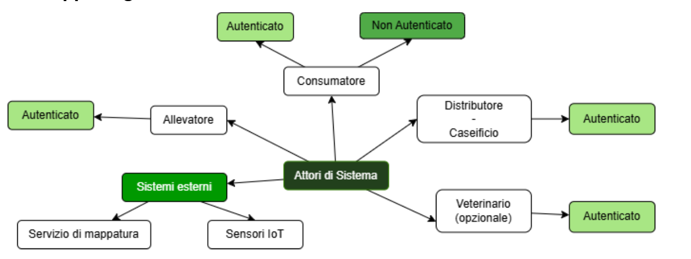

# Deliverable D1

- Deadline: 27/03/2026
- Gruppo: ID 13

## Componenti del gruppo

- Stefania, Milani, 243506
- Alice, Bortolotti, 244397
- Elena, Carmagnani, 244462

## 1. Obiettivi del Progetto

### 1.1 Obiettivi Principali

- O1: Monitorare il benessere delle vacche, raccogliendo dati vitali (come temperatura, frequenza cardiaca, attività e posizione) tramite sensori, e fornire alert in caso di anomalie o problemi di salute.
- O2: Tracciare e mostrare la filiera dei prodotti caseari, dalla creazione del lotto di latte fino al distributore, offrendo agli utenti – consumatori, allevatori e distributori – una panoramica trasparente sulla provenienza, qualità e sostenibilità.
- O3: Valorizzare i piccoli produttori locali, dando loro la possibilità di mostrare pratiche sostenibili e di differenziarsi dalla grande distribuzione grazie alla tracciabilità digitale e all’autenticità delle informazioni.
- O4: Offrire agli utenti non autenticati, consumatori e persone interessate, la possibilità di visualizzare le aziende, i prodotti e le pratiche adottate, supportando scelte consapevoli e preferendo produttori che rispettano il benessere animale, anche facilitando l’inclusione di alcuni prodotti nella dieta vegana tramite trasparenza.
- O5: Fornire ai produttori un supporto al processo di certificazione, permettendo loro di dichiarare eventuali certificazioni possedute e organizzare i dati e documenti necessari per una futura richiesta, ma offrendo anche un sistema alternativo di verifica basato sulla tracciabilità dei processi e dati raccolti, rendendo la qualità garantita e verificabile anche senza certificazione ufficiale.
- O6: Fornire una dashboard intuitiva che permetta agli utenti (allevatori e distributori) di gestire, monitorare e visualizzare i dati relativi agli animali, i prodotti, la filiera e le recensioni.

### 1.2 Obiettivi Futuri

- O7: Estendere il ruolo di Allevatore con un modulo che permette di gestire la vendita del prodotto grezzo a Distributori terzi, nel caso in cui l’Allevatore non si occupi della lavorazione e della vendita del prodotto finale.
- O8: Estendere il sistema ad altri animali da allevamento (es. pecore, capre, galline, ecc.) tramite moduli dedicati.
- O9: Integrare funzioni predittive basate sull’analisi dei dati raccolti (es. predizioni sulle vendite dato l’andamento della produzione, consigli basati sui dati sanitari dell’animale, ecc.).

## 2. Analisi SWOT:

### Punti di forza (Strengths):

- Soluzione innovativa che offre trasparenza sulla salute delle vacche e sulla qualità dei prodotti.
- Supporto ai piccoli produttori locali e promozione di pratiche sostenibili.
- Risponde alle esigenze di consumatori attenti al benessere animale e all’ambiente.
- Facilità di accesso alle informazioni tramite sistema digitale.
- Possibilità per coloro che seguono una dieta vegana, grazie alla trasparenza e attenzione al benessere animale, di valutare la reintroduzione di alcuni alimenti nella propria dieta in modo consapevole.
- Dashboard intuitiva per la gestione e monitoraggio dei dati da parte di allevatori, distributori e consumatori.
- Strumento che permette ai produttori di organizzare facilmente i dati e i documenti relativi al proprio allevamento, anche in vista di un’eventuale richiesta di certificazione ufficiale.

### Punti di debolezza (Weaknesses):

- Raccogliere dati affidabili sul benessere animale può essere difficile. Le condizioni che concorrono al benessere di un animale sono molteplici.
- Molti produttori si trovano in zone remote (come pascoli di alta montagna) e potrebbero essere poco disponibili ad adottare tecnologie digitali, preferendo metodi tradizionali.
- In molte aree rurali o di montagna la connessione Internet è assente o scarsa, rendendo difficile l’implementazione di soluzioni digitali.
- La piattaforma potrebbe apparire troppo complessa o impegnativa per piccoli produttori privi di esperienza digitale.

### Opportunità (Opportunities):

- Crescita del mercato dei prodotti sostenibili, locali e trasparenti.
- Maggiore sensibilità dei consumatori verso il reale benessere animale.
- Possibilità di espansione verso altri tipi di allevamenti e filiere alimentari.
- Collaborazioni con associazioni ambientaliste e vegane.
- Potenziale collaborazione con enti certificatori o veterinari per aumentare il valore e la credibilità dei dati raccolti.
- Supportare il processo di certificazione grazie alla raccolta ordinata dei dati, incentivando nuovi e/o piccoli produttori a ottenere riconoscimenti ufficiali.

### Minacce (Threats):

- Resistenza da parte di produttori che non vogliono condividere dati o adottare sistemi tecnologici.
- Concorrenti che offrono soluzioni simili o piattaforme di tracciabilità.
- Possibili cambiamenti nelle normative sul benessere animale.
- Non tutti i consumatori sono sensibili alla tematica del benessere animale, quindi potrebbe non interessare alcuni consumatori.
- I parametri necessari per la certificazione potrebbero essere limitati o non pienamente noti, e il team potrebbe non avere una conoscenza approfondita delle procedure di certificazione ufficiale.
- Presenza di piattaforme ministeriali di monitoraggio della salute veterinaria degli allevamenti in Italia, necessarie per il conseguimento di certificazioni ufficiali. (ClassyFarm)

## 3. Attori del sistema

### 3.2 Mappa degli Attori

### 2.1 Utenti

### 3.2 Utenti

- Consumatore
	(utente non autenticato): può visualizzare informazioni sulle aziende locali e sui prodotti offerti, senza funzionalità avanzate.
	(utente autenticato): può salvare aziende e prodotti tra i preferiti, consultare dettagli avanzati (come i passi delle vacche e dati di filiera), interagire con la piattaforma (recensioni), aggiungere distributori tra i preferiti su Google Maps.
- Allevatore (utente autenticato): può registrare il proprio allevamento, inserire dati degli animali (foto, razza, ID/tag), monitorare la salute (dati vitali, attività), gestire la filiera (creazione lotti, tracciabilità), ricevere notifiche e inserire certificazioni.
- Distributore/Caseificio (utente autenticato): può ricevere e aggiornare informazioni sulla filiera, tracciare lotti, collaborare con altri attori e ricevere recensioni.
- Veterinario (utente autenticato/opzionale): può collaborare fornendo commenti di carattere sanitario e supporto agli allevatori.

### 3.3 Sistemi esterni

- Servizio di mappatura (per geolocalizzazione allevamenti e caseifici e visualizzazione aree di pascolo)
- Sensori di contapassi e di attività (per monitoraggio animali) e per la raccolta dati vitali (temperatura, frequenza cardiaca, GPS, esposizione solare… tramite dispositivi IoT o sensoristica dedicata).

## 4. Requisiti funzionali per attore

### 4.1 Consumatore (Utente non autenticato):

- RF1.1: Visualizzare informazioni sulle aziende locali e i prodotti offerti.
- RF1.2: Consultare dati relativi al benessere animale, tracciabilità e qualità dei prodotti.
- RF1.3: Visualizzare la posizione dei Produttori/Distributori su mappa.

### 4.2 Consumatore (Utente autenticato):

- RF2.1: Salvare aziende e prodotti tra i preferiti.
- RF2.2: Accesso a dati dettagliati (es. attività, passi delle vacche, parametri di filiera).
- RF2.3: Recensire aziende e/o Distributori.
- RF2.4: Aggiungere Distributori tra i preferiti su Google Maps o su app.

### 4.3 Allevatore:

- RF3.1: Registrarsi come Utente/Allevatore.
- RF3.2: Inserire il proprio allevamento e aree di pascolo (selezionabili su mappa).
- RF3.3: Inserire e gestire dati degli animali (ID/tag, nome, razza, foto, giorno di nascita/acquisizione).
- RF3.4: Monitorare lo stato di salute delle vacche (raccolta dati vitali: temperatura, frequenza cardiaca, sensore di attività, GPS, esposizione solare).
- RF3.5: Ricevere notifiche quando una vacca è fuori dalla zona di pascolo. (opzionale)
- RF3.6: Ricevere notifiche quando una vacca presenta parametri anomali.
- RF3.7: Monitorare la qualità del prodotto (analisi latte, pastorizzazione, conservazione).
- RF3.8: Creare e tracciare lotti di produzione (latte).
- RF3.9: Generare schede prodotto certificate associabili ai lotti e rispettivi QRCode.
- RF3.10: Visualizzare dati aggregati su benessere animale, produzione, filiera e recensioni in modo intuitivo e comprensibile.
- RF3.11: Inserire certificazioni esistenti e organizzare documentazione per nuove certificazioni. (opzionale)

### 4.4 Distributore/Caseificio:

- RF4.1: Ricevere e aggiornare informazioni sulla filiera.
- RF4.2: Tracciare lo stato dei prodotti (lotti) e collaborare con allevatori.
- RF4.3: Interagire con i consumatori attraverso le recensioni.

### 4.5 Veterinario (opzionale):

- RF5.1: Collaborare inserendo dati sanitari e indicando suggerimenti.

### 4.6 Sistemi esterni:

- RF6.1: Integrare dati dei sensori (contapassi, ID/tag, raccolta dati vitali).
- RF6.2: Collegamento a servizio di mappatura e navigazione satellitare (es. Google Maps, OpenStreetMap) per geolocalizzazione allevamenti, aree di pascolo e distributori.

Volendo possiamo aggiungere:

- Sezione informativa/formazione - dove l’utente trova delle informazioni come riconoscere il benessere delle vacche, pascolo, il latte, e altro. Benefici degli animali sull’umano ecc.
- Fattorie didattiche: aggiungiamo un flag??

## 5. Requisiti non funzionali

- RNF1: Il sistema deve garantire tempi di risposta inferiori a 5 secondi nelle ricerche.
- RNF2: Il sistema deve essere accessibile da dispositivi desktop e mobile (sistemi Android).
- RNF3: La piattaforma deve garantire la sicurezza dei dati, con autenticazione e autorizzazione (login, registrazione, requisiti sulle password, livelli di accesso).
- RNF4: Tutti i dati personali e sanitari degli animali devono essere trattati secondo le normative sulla privacy in vigore.
- RNF5: Il sistema deve essere scalabile, in grado di gestire un numero crescente di allevatori, distributori e consumatori ed, eventualmente, estendibile ad altre specie di animali da allevamento.
- RNF6: La piattaforma deve garantire l’integrità e la tracciabilità dei dati inseriti.
- RNF7: Il sistema deve essere disponibile 24/7 con downtime minimo.
- RNF8: Il sistema deve essere facilmente integrabile con sensori e dispositivi IoT.
- RNF9: L’interfaccia utente deve essere intuitiva e facilmente navigabile.
- RNF10: Devono essere previsti backup regolari dei dati, con possibilità di ripristino.
- RNF11: Il sistema deve essere multilingua, almeno italiano e inglese.
- RNF12: Protezione contro accessi non autorizzati e attacchi informatici.
- RNF13: I dati devono essere sincronizzati anche in presenza di connessione intermittente o scarsa.
- RNF14: L’autenticazione dell’utente deve avvenire attraverso l’inserimento di nome utente e password o, alternativamente, con l’associazione di account Gmail esistente.

## 6. Use case diagrams e casi d'uso
### Use case diagram 

#### Use case 1.1 - Aggiornamento dati filiera 
#### Use case 2.1 - Consultazione prodotto
#### Use case 3.1 - Consultazione lista produttori locali
#### Use case 3.2 - Consultazione lista distributori/produttori locali: con autenticazione 
#### Use case 4.1 - Visualizzazione dashboard
#### Use case 5.1 - Creazione Account Consumatore 
#### Use case 5.2 - Creazione Account Creazione Account Consumatore: Indirizzo e-mail Non Valido

## 7. Diagramma BPMN

